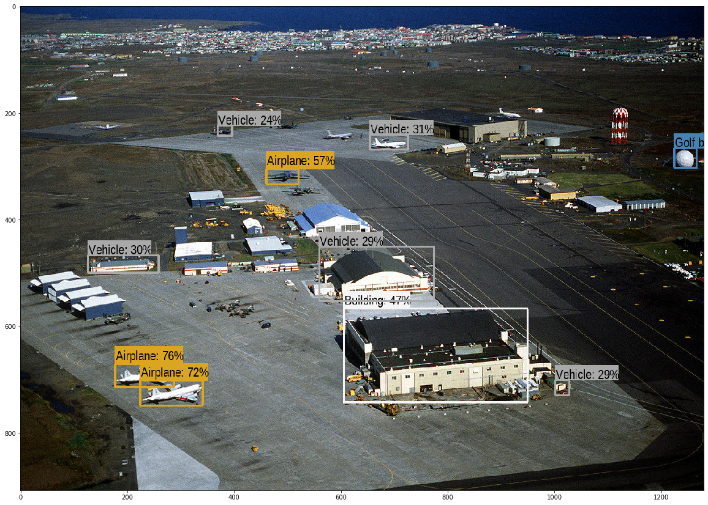
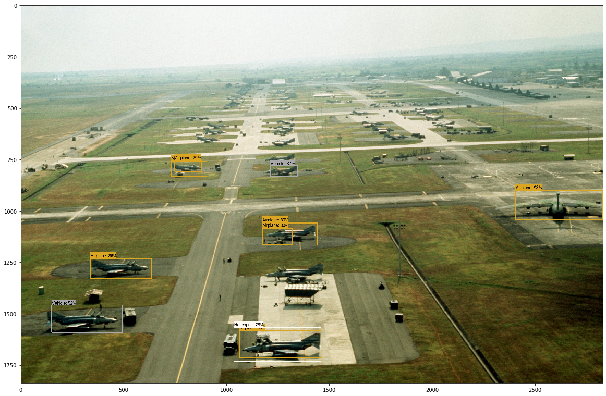

### Tensorflow-based приложение для обнаружения вертолетов и самолетов на земле

Используется десктопная версия с установкой tensorflow v2.1. Локально устанавливается pretrain model Inception V3, обученная помимо прочего на изображениях вертолетов и самолетов.

Результат работы приложения на картинке.

ToDo: реализация в embedded варианте на борту дрона с использованием tensorflow board.

