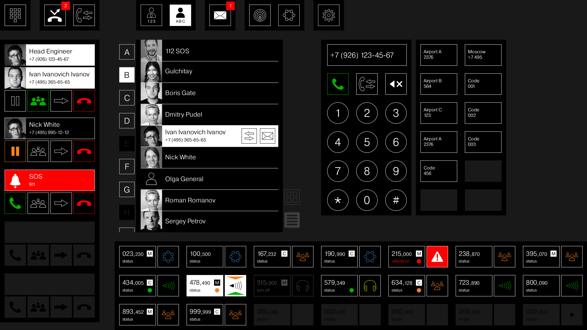

### VoIP-based Voice Communication System (VCS)

VCS, или системы коммутации речевой связи (СКРС), используются авиадиспетчерами для связи с бортами, находящимися в воздухе, с использованием различных режимов: множественный выход на передачу и множественный прием с приоритетами, радиоретрансляция, обмен с другими диспетчерами и руководителем полетов.

Аппаратная реализация: [VoIP Gateway](http://www.primaria.ru/ru/286)

ПО разработано в соответствии с требованиями Евроконтроля к IP VCS (ED-136, ED-137). Аппаратная платформа - универсальный VoIP Gateway содержащий ARM/DSP компьютерный модуль. DSP используется для ресурсоемкой процедуры эхоподавления.

Модули:

* ftgui. Пользовательский интерфейс (Frondend)
* ftsip. Машина состояний использующая протокол SIP. Используются расширения протокола SIP для поддержки обмена с радиостанциями диспетчера.

### Два совместно работающих VoIP шлюза

### Пользовательский интерфейс для внутреннего обмена

### Пользовательский интерфейс для радиообмена

